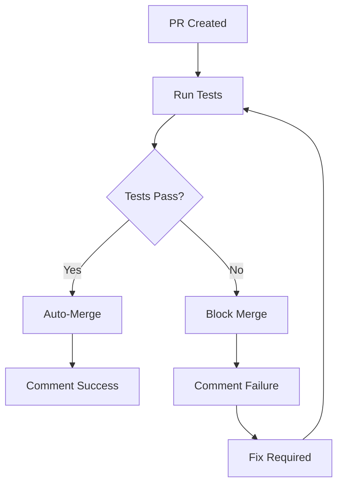

# GitHub Actions CI/CD Documentation

## Overview

This project uses GitHub Actions to automatically run tests, enforce code quality, and manage pull request merging. The CI/CD pipeline ensures that only tested, working code gets merged into the main branch.

## Workflow Files

### 1. CI/CD Pipeline (`.github/workflows/ci-cd.yml`)

**Triggers:**

- Pull requests to `main` branch
- Pushes to `main` branch

**Jobs:**

#### Test Job

- **Purpose**: Run comprehensive test suite
- **Steps**:
  1. Checkout code
  2. Setup Node.js environment
  3. Install dependencies
  4. Run ESLint for code quality
  5. Execute unit tests
  6. Generate test coverage
  7. Comment results on PR
- **Outputs**: Test result status (success/failure)

#### Auto-Merge Job

- **Purpose**: Automatically merge PRs when tests pass
- **Conditions**: Only runs on PRs with successful tests
- **Features**:
  - Checks if PR is mergeable
  - Uses squash merge method
  - Adds descriptive commit messages
  - Comments on successful/failed merge attempts

#### Deploy-Check Job

- **Purpose**: Validate production builds
- **Conditions**: Only runs on main branch with successful tests
- **Steps**:
  1. Build production version
  2. Test production build
  3. Upload build artifacts

### 2. Branch Protection (`.github/workflows/branch-protection.yml`)

**Purpose**: Enforce PR standards and requirements

**Checks**:

- Draft PR detection
- PR title validation (minimum 5 characters)
- Description completeness warning
- Status check requirements

## Automated Features

### ✅ What Happens on PR Creation/Update

1. **Immediate Checks**:

   - Branch protection validation
   - PR format verification
   - Draft status check

2. **Test Execution**:

   - ESLint code quality check
   - Full unit test suite (35+ tests)
   - Test coverage generation
   - Performance validation

3. **Result Communication**:

   - Detailed comment with test results
   - Coverage information
   - Pass/fail status with emojis
   - Next steps guidance

4. **Auto-Merge Decision**:
   - If tests pass: Automatic merge with notification
   - If tests fail: Block merge with failure details
   - If conflicts exist: Manual intervention required

### 🔍 Test Coverage Requirements

- **Minimum Coverage**: Enforced by tests
- **Test Categories**:
  - Unit tests (component behavior)
  - Integration tests (user workflows)
  - Performance tests (speed benchmarks)
  - Utility tests (business logic)

### 🚀 Merge Process



## Configuration Details

### Node.js Environment

- **Version**: 18 (LTS)
- **Package Manager**: npm
- **Cache Strategy**: npm cache for faster builds

### Test Configuration

- **Framework**: Vitest
- **Environment**: jsdom (browser simulation)
- **Reporters**: JSON and text output
- **Coverage**: Detailed coverage reports

### Merge Strategy

- **Method**: Squash merge (clean history)
- **Title Format**: `Auto-merge: [PR Title]`
- **Message**: Includes PR number and description

## Branch Protection Rules

To fully enable this workflow, configure these branch protection rules in GitHub:

### Main Branch Settings

1. **Require pull request reviews**: ✅
2. **Require status checks**: ✅
   - Required checks:
     - `Run Tests`
     - `Required Status Check`
3. **Require branches to be up to date**: ✅
4. **Require linear history**: ✅ (optional)
5. **Include administrators**: ✅

### Status Check Configuration

```yaml
Required status checks:
  - test (Run Tests)
  - status-check (Required Status Check)
  - enforce-tests (Enforce Test Requirements)
```

## Setup Instructions

### 1. Repository Setup

```bash
# Ensure all workflow files are in place
.github/
├── workflows/
│   ├── ci-cd.yml
│   └── branch-protection.yml
├── ISSUE_TEMPLATE/
│   ├── bug_report.yml
│   └── feature_request.yml
└── pull_request_template.md
```

### 2. GitHub Settings

1. Go to repository **Settings** → **Branches**
2. Add rule for `main` branch
3. Enable required status checks
4. Configure merge restrictions

### 3. Permissions

Ensure the repository has these permissions enabled:

- **Actions**: Read and write
- **Pull requests**: Write
- **Contents**: Write
- **Metadata**: Read

## Troubleshooting

### Common Issues

#### Tests Fail in CI but Pass Locally

- Check Node.js version compatibility
- Verify environment variables
- Ensure dependencies are locked (package-lock.json)

#### Auto-Merge Doesn't Work

- Verify branch protection rules
- Check workflow permissions
- Ensure PR is not a draft
- Confirm no merge conflicts exist

#### Status Checks Don't Appear

- Check workflow syntax with GitHub Actions validator
- Verify trigger conditions match PR events
- Ensure required checks are properly named

### Debug Commands

```bash
# Local test verification
npm run test:run
npm run lint
npm run build

# Coverage verification
npm run test:coverage
```

## Security Considerations

### Token Permissions

- Uses `GITHUB_TOKEN` with minimal required permissions
- No external secrets required for basic functionality
- All actions use official GitHub actions or well-maintained community actions

### Workflow Security

- No code execution from PR comments
- Limited to repository scope
- Automated merge only after successful validation

## Monitoring and Metrics

### Available Metrics

- Test execution time
- Test coverage percentage
- Build success/failure rates
- Auto-merge success rate
- PR processing time

### GitHub Insights

- Check **Actions** tab for workflow runs
- View **Pull requests** for merge patterns
- Monitor **Insights** → **Pulse** for activity

## Customization Options

### Modifying Test Requirements

Edit `.github/workflows/ci-cd.yml`:

```yaml
# Add additional test commands
- name: Run integration tests
  run: npm run test:integration

# Modify coverage thresholds
- name: Check coverage threshold
  run: npm run test:coverage -- --coverage.threshold.global.lines=90
```

### Changing Merge Strategy

```yaml
# In auto-merge job
merge_method: "merge" # Options: merge, squash, rebase
```

### Adding Deployment

```yaml
# Add to deploy-check job
- name: Deploy to staging
  run: npm run deploy:staging
  if: github.ref == 'refs/heads/main'
```

## Best Practices

### For Contributors

1. **Write Tests**: Ensure new features have corresponding tests
2. **Update Documentation**: Keep README and docs current
3. **Use Descriptive PR Titles**: Help automated systems and reviewers
4. **Small, Focused PRs**: Easier to review and test
5. **Test Locally**: Run `npm run test:run` before pushing

### For Maintainers

1. **Monitor Workflow Performance**: Check action execution times
2. **Update Dependencies**: Keep GitHub Actions up to date
3. **Review Auto-Merge Results**: Ensure quality is maintained
4. **Adjust Thresholds**: Modify coverage/performance requirements as needed
5. **Document Changes**: Update this file when modifying workflows

## Support

For issues with the CI/CD pipeline:

1. Check the **Actions** tab for detailed logs
2. Review this documentation for common solutions
3. Create an issue using the bug report template
4. Contact repository maintainers for complex issues
